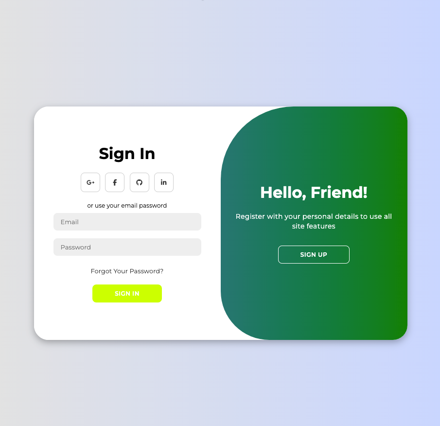

# 🧬 Patient Login Prototype

This project demonstrates a modern, secure Login & Account Creation UI tailored for applications in the Bio Health industry. Designed with patients and clinicians in mind, this prototype is responsive, accessible, and visually clean — ideal for patient portals, health dashboards, or wellness platforms.

---

## 📸 Screenshot

---

## 🎥 Tutorial

Check out the tutorial to learn how this login page was built with modern web technologies, animations, and responsive design:  
[Open on YouTube](https://youtu.be/YecGQFKf6q0)

---
 ✨ Features
🔐 Dual-panel Login + Create Account toggle

✅ Client-side validation (email format, password strength)

🧭 Clear visual hierarchy for a patient-first experience

📱 Mobile-responsive design

🎨 CSS keyframe animations for smooth transitions

💡 Built with scalability and modularity in mind

---
🛠️ Tech Stack
HTML5 & CSS3

JavaScript (ES6+)

Flexbox for layout

Keyframes for animations

Developed using VS Code

---
🎯 Bio Health Use Cases
This UI prototype is ideal for:

Secure patient login portals

Telehealth sign-in pages

Personalized health tracker dashboards

Wellness program login workflows

---
## 🔗 Related Projects

- [Bio Health Data Explorer](https://github.com/SummerJyl/your-bio-health-data-explorer-repo)  
- [Personal Finance Dashboard](https://github.com/SummerJyl/your-personal-finance-dashboard-repo)

---

## 📄 License

[Specify your license, if any]
